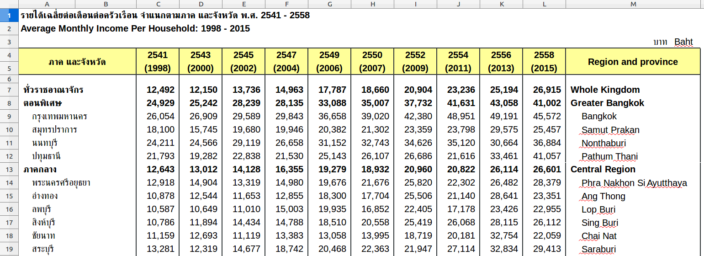
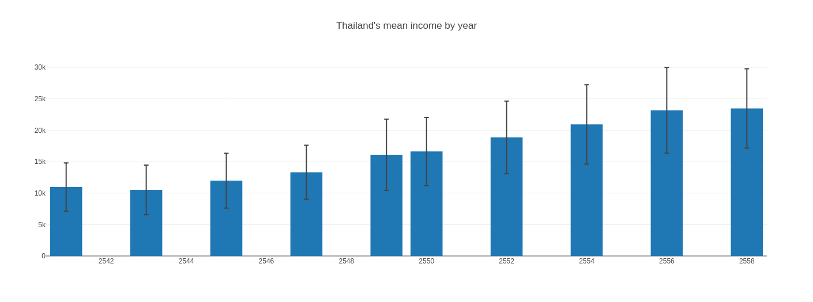

# Government Open Data of Thailand
> Project ลองเล่นกับ Open Data ในประเทศไทย เพื่อหา Insight ใหม่ ๆ

## 1. Average Household Income

### Data 
 

### Visualizaition
 
 

<iframe src="https://www.facebook.com/plugins/video.php?href=https%3A%2F%2Fwww.facebook.com%2Fdatawizthailand%2Fvideos%2F289072071766758%2F&show_text=0&width=560" width="560" height="280" style="border:none;overflow:hidden" scrolling="no" frameborder="0" allowTransparency="true" allowFullScreen="true"></iframe>

## References
* Data gov Thailand:[https://data.go.th/default.aspx](https://data.go.th/default.aspx) 